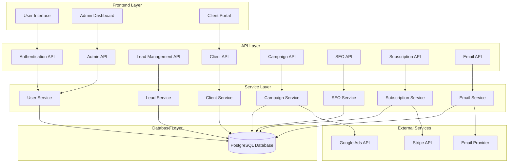
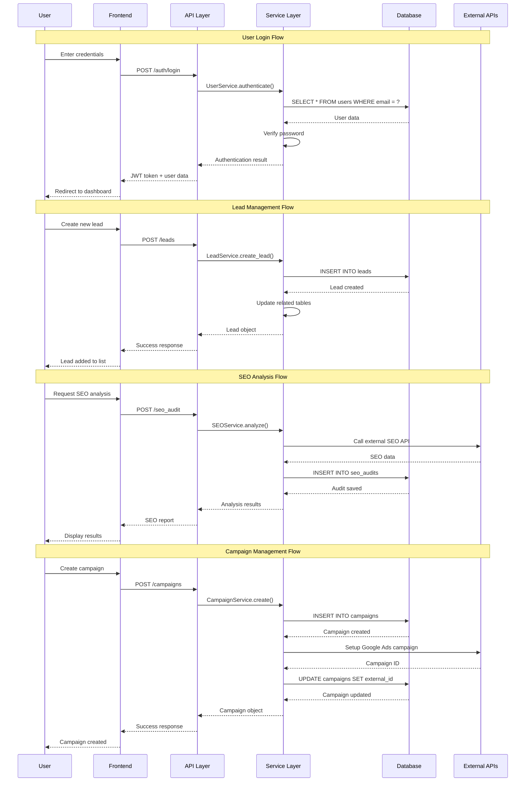
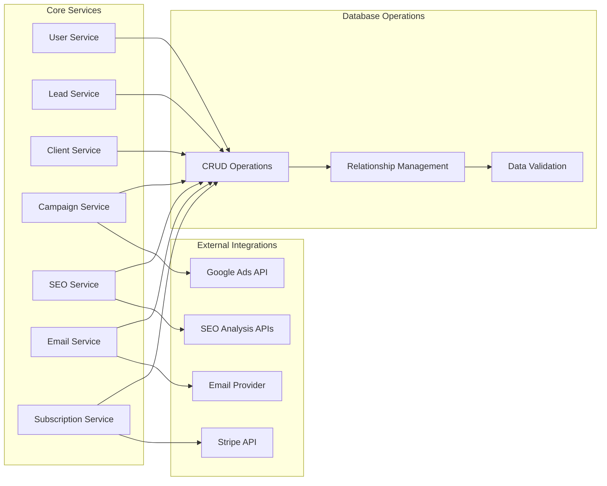
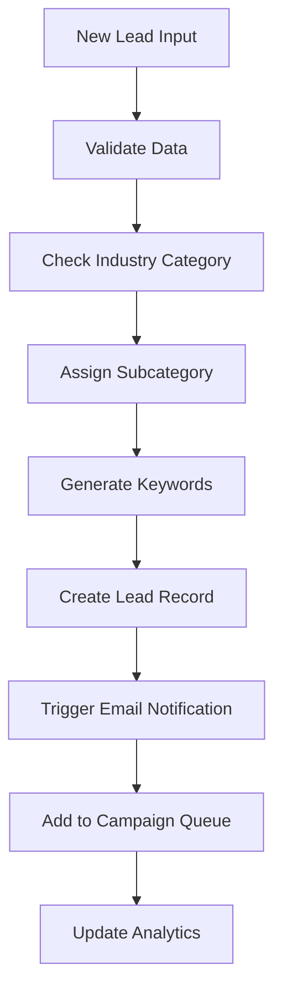
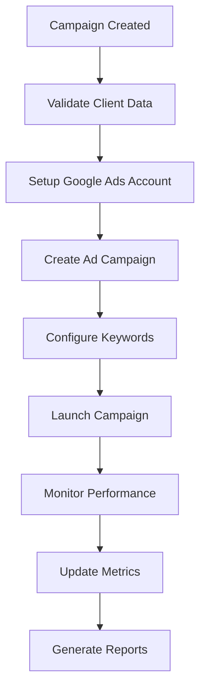
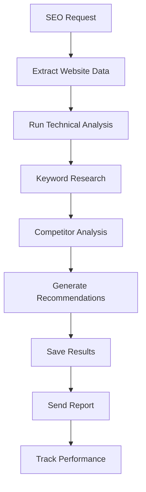

# WeTechForU Healthcare Marketing Platform - API Flow & Database Relationships

## 🏗️ System Architecture Overview



## 📊 Database Schema Relationships

```mermaid
erDiagram
    USERS {
        int id PK
        string email UK
        string password_hash
        boolean is_admin
        datetime created_at
        datetime updated_at
    }
    
    CLIENTS {
        int id PK
        string name
        string email UK
        string phone
        string company
        string industry
        string status
        datetime created_at
        datetime updated_at
    }
    
    LEADS {
        int id PK
        string name
        string email
        string phone
        string company
        int industry_category_id FK
        int industry_subcategory_id FK
        string source
        string status
        text notes
        datetime created_at
        datetime updated_at
    }
    
    INDUSTRY_CATEGORIES {
        int id PK
        string name
        text description
    }
    
    INDUSTRY_SUBCATEGORIES {
        int id PK
        string name
        int category_id FK
        text description
    }
    
    SEARCH_KEYWORDS {
        int id PK
        string keyword
        int category_id FK
        int subcategory_id FK
    }
    
    SEO_AUDITS {
        int id PK
        int client_id FK
        string url
        int score
        json issues
        json recommendations
        datetime created_at
    }
    
    CAMPAIGNS {
        int id PK
        string name
        int client_id FK
        string type
        string status
        decimal budget
        date start_date
        date end_date
        datetime created_at
    }
    
    COMMUNICATIONS {
        int id PK
        int client_id FK
        string type
        string subject
        text content
        datetime sent_at
        string status
    }
    
    MARKETING_PERFORMANCE {
        int id PK
        int campaign_id FK
        string metric
        decimal value
        date date
        text notes
    }
    
    KEYWORD_ANALYSES {
        int id PK
        int client_id FK
        string keyword
        int volume
        int difficulty
        int position
        datetime created_at
    }
    
    COMPETITOR_ANALYSES {
        int id PK
        int client_id FK
        string competitor_url
        json analysis_data
        datetime created_at
    }
    
    KEYWORD_RECOMMENDATIONS {
        int id PK
        int client_id FK
        string keyword
        string recommendation_type
        int priority
        datetime created_at
    }
    
    SUBSCRIPTION_PLANS {
        int id PK
        string name
        text description
        decimal price
        string billing_cycle
        json features
    }
    
    FEATURES {
        int id PK
        string name
        text description
        string category
    }
    
    PLAN_FEATURES {
        int id PK
        int plan_id FK
        int feature_id FK
        boolean included
    }
    
    CLIENT_SUBSCRIPTIONS {
        int id PK
        int client_id FK
        int plan_id FK
        string status
        date start_date
        date end_date
        datetime created_at
    }
    
    FEATURE_USAGE {
        int id PK
        int client_id FK
        int feature_id FK
        int usage_count
        datetime last_used
    }
    
    CLIENT_GOOGLE_ADS {
        int id PK
        int client_id FK
        string account_id
        text refresh_token
        string status
        datetime created_at
    }
    
    EMAIL_TEMPLATES {
        int id PK
        string name
        string subject
        text content
        string type
        datetime created_at
    }
    
    EMAIL_TRACKING {
        int id PK
        string email_id
        string recipient_email
        datetime opened_at
        datetime clicked_at
        string status
    }
    
    CONTENT_APPROVALS {
        int id PK
        int client_id FK
        string content_type
        text content
        string status
        datetime approved_at
        int approved_by FK
    }
    
    %% Relationships
    CLIENTS ||--o{ LEADS : "has"
    CLIENTS ||--o{ SEO_AUDITS : "has"
    CLIENTS ||--o{ CAMPAIGNS : "has"
    CLIENTS ||--o{ COMMUNICATIONS : "receives"
    CLIENTS ||--o{ KEYWORD_ANALYSES : "has"
    CLIENTS ||--o{ COMPETITOR_ANALYSES : "has"
    CLIENTS ||--o{ KEYWORD_RECOMMENDATIONS : "has"
    CLIENTS ||--o{ CLIENT_SUBSCRIPTIONS : "subscribes"
    CLIENTS ||--o{ FEATURE_USAGE : "uses"
    CLIENTS ||--o{ CLIENT_GOOGLE_ADS : "connects"
    CLIENTS ||--o{ CONTENT_APPROVALS : "requires"
    
    INDUSTRY_CATEGORIES ||--o{ INDUSTRY_SUBCATEGORIES : "contains"
    INDUSTRY_CATEGORIES ||--o{ LEADS : "categorizes"
    INDUSTRY_CATEGORIES ||--o{ SEARCH_KEYWORDS : "defines"
    
    INDUSTRY_SUBCATEGORIES ||--o{ LEADS : "subcategorizes"
    INDUSTRY_SUBCATEGORIES ||--o{ SEARCH_KEYWORDS : "refines"
    
    CAMPAIGNS ||--o{ MARKETING_PERFORMANCE : "tracks"
    
    SUBSCRIPTION_PLANS ||--o{ PLAN_FEATURES : "includes"
    SUBSCRIPTION_PLANS ||--o{ CLIENT_SUBSCRIPTIONS : "offered"
    
    FEATURES ||--o{ PLAN_FEATURES : "included_in"
    FEATURES ||--o{ FEATURE_USAGE : "tracked"
    
    USERS ||--o{ CONTENT_APPROVALS : "approves"
```



## 🔄 API Request Flow



## 🔗 Service Integration Flow



## 📈 Data Flow Patterns

### 1. Lead Processing Flow


### 2. Campaign Execution Flow


### 3. SEO Analysis Flow


## 🔧 API Endpoint Structure

### Authentication Endpoints
```
POST   /auth/login          - User login
POST   /auth/logout         - User logout
GET    /auth/profile        - Get user profile
PUT    /auth/profile        - Update user profile
```

### Admin Endpoints
```
GET    /admin/              - Admin dashboard
GET    /admin/users         - List all users
POST   /admin/users         - Create user
PUT    /admin/users/<id>    - Update user
DELETE /admin/users/<id>    - Delete user
```

### Lead Management Endpoints
```
GET    /leads               - List leads
POST   /leads               - Create lead
GET    /leads/<id>          - Get lead details
PUT    /leads/<id>          - Update lead
DELETE /leads/<id>          - Delete lead
GET    /leads/export        - Export leads
```

### Client Management Endpoints
```
GET    /clients             - List clients
POST   /clients             - Create client
GET    /clients/<id>        - Get client details
PUT    /clients/<id>        - Update client
DELETE /clients/<id>        - Delete client
GET    /clients/<id>/reports - Get client reports
```

### Campaign Management Endpoints
```
GET    /campaigns           - List campaigns
POST   /campaigns           - Create campaign
GET    /campaigns/<id>      - Get campaign details
PUT    /campaigns/<id>      - Update campaign
DELETE /campaigns/<id>      - Delete campaign
GET    /campaigns/<id>/performance - Get performance data
```

### SEO Analysis Endpoints
```
GET    /seo_audit           - List SEO audits
POST   /seo_audit           - Create SEO audit
GET    /seo_audit/<id>      - Get audit details
GET    /analytics           - Get analytics data
POST   /analytics/export    - Export analytics
```

### Subscription Management Endpoints
```
GET    /subscription-plans  - List plans
POST   /subscription-plans  - Create plan
GET    /billing/invoices    - List invoices
POST   /billing/payment     - Process payment
GET    /billing/usage       - Get usage data
```

## 🗃️ Database Indexes & Performance

### Recommended Indexes
```sql
-- Performance indexes
CREATE INDEX idx_leads_email ON leads(email);
CREATE INDEX idx_leads_industry ON leads(industry_category_id);
CREATE INDEX idx_clients_email ON clients(email);
CREATE INDEX idx_campaigns_client ON campaigns(client_id);
CREATE INDEX idx_seo_audits_client ON seo_audits(client_id);
CREATE INDEX idx_communications_client ON communications(client_id);
CREATE INDEX idx_keyword_analyses_client ON keyword_analyses(client_id);

-- Composite indexes
CREATE INDEX idx_leads_status_created ON leads(status, created_at);
CREATE INDEX idx_campaigns_status_date ON campaigns(status, start_date);
CREATE INDEX idx_client_subscriptions_status ON client_subscriptions(status, end_date);
```

### Query Optimization Tips
1. Use `SELECT` specific columns instead of `SELECT *`
2. Implement pagination for large datasets
3. Use database views for complex queries
4. Cache frequently accessed data
5. Monitor slow queries and optimize

---

*This diagram represents the current working system. Additional features from the stashed development work will extend this architecture.*
