# 📞 Call Routing & IVR System Documentation

## Overview

This system provides intelligent call routing for Carepitome portal with:
- **IVR Menu** - Digit-based routing (Press 1 for billing, etc.)
- **AI Call Handling** - AI answers basic questions before routing
- **Staff Routing** - Routes to staff members (portal or phone)
- **Department Routing** - Routes to departments (billing, appointments, etc.)
- **Voicemail** - Fallback when no staff available
- **Call Forwarding** - Routes calls from clinic numbers to Carepitome

---

## 🏗️ System Architecture

```mermaid
graph TB
    Patient[👤 Patient Calls Clinic Number]
    ClinicNum[📱 Clinic Number<br/>+14698880705]
    TwilioNum[☁️ Twilio Receiving Number<br/>+18176016812]
    
    CallRouting[🔀 Call Routing Service]
    
    AIHandling[🤖 AI Call Handling]
    IVRMenu[📋 IVR Menu]
    
    StaffRouting[👥 Staff Routing]
    DepartmentRouting[🏢 Department Routing]
    Voicemail[📧 Voicemail]
    
    StaffPortal[💻 Staff Portal]
    StaffPhone[📱 Staff Phone]
    
    Patient --> ClinicNum
    ClinicNum --> TwilioNum
    TwilioNum --> CallRouting
    
    CallRouting --> AIHandling
    CallRouting --> IVRMenu
    
    AIHandling --> StaffRouting
    IVRMenu --> StaffRouting
    IVRMenu --> DepartmentRouting
    IVRMenu --> Voicemail
    
    StaffRouting --> StaffPortal
    StaffRouting --> StaffPhone
    
    DepartmentRouting --> StaffRouting
    StaffRouting --> Voicemail
```



---

## 📊 Database Schema

### Tables Created

1. **staff_call_routing** - Staff routing configuration
2. **ivr_menu_options** - IVR menu options (Press 1, 2, etc.)
3. **call_routing_history** - Tracks routing decisions
4. **staff_call_availability** - Real-time staff availability
5. **voicemail_messages** - Voicemail storage

### Key Columns

**call_settings** (extended):
- `enable_ai_call_handling` - Enable AI to answer calls
- `enable_ivr_menu` - Enable IVR menu
- `ivr_menu_config` - IVR configuration JSON
- `voicemail_enabled` - Enable voicemail
- `voicemail_message` - Voicemail greeting
- `voicemail_email` - Email for voicemail notifications

**staff_call_routing**:
- `receive_calls_in_portal` - Staff receives calls in Carepitome portal
- `use_staff_phone` - Route to staff's personal phone
- `staff_phone_number` - Staff's phone number
- `routing_priority` - Priority order (lower = higher priority)
- `department` - Department assignment
- `is_available_for_calls` - Staff availability toggle

**ivr_menu_options**:
- `menu_digit` - Digit to press (1, 2, 3, etc.)
- `menu_label` - "For billing, press 1"
- `route_type` - "staff", "department", "voicemail", "ai", "external"
- `route_target_id` - Staff ID or department ID
- `ai_fallback_to_staff` - If AI can't answer, route to staff

---

## 🔄 Call Flow Examples

### Flow 1: IVR Menu → Staff Routing

```
1. Patient calls clinic number
2. Call forwarded to Twilio number
3. IVR menu plays: "For billing, press 1. For appointments, press 2..."
4. Patient presses 1
5. System routes to billing department staff
6. If staff unavailable → Next available staff
7. If all unavailable → Voicemail
```

### Flow 2: AI Handling → Staff Fallback

```
1. Patient calls clinic number
2. AI answers: "Thank you for calling. How can I help you?"
3. Patient speaks: "I need to pay my bill"
4. AI processes and responds
5. If AI can't answer → Routes to staff
6. Staff answers in portal or phone
```

### Flow 3: Direct Staff Routing

```
1. Patient calls clinic number
2. No IVR, no AI → Direct routing
3. System finds available staff by priority
4. Routes to staff portal or phone
5. If unavailable → Voicemail
```

---

## ⚙️ Configuration

### Setting Up IVR Menu

1. **Enable IVR in call_settings:**
   ```sql
   UPDATE call_settings 
   SET enable_ivr_menu = true 
   WHERE client_id = 123;
   ```

2. **Create IVR Menu Options:**
   ```sql
   INSERT INTO ivr_menu_options (
     client_id, call_settings_id, menu_digit, menu_label,
     route_type, department_name
   ) VALUES (
     123, 1, '1', 'For billing, press 1',
     'department', 'billing'
   );
   ```

3. **Configure Department Routing:**
   - Set `route_type = 'department'`
   - Set `department_name = 'billing'`
   - System will route to staff in that department

### Setting Up Staff Routing

1. **Add Staff to Routing:**
   ```sql
   INSERT INTO staff_call_routing (
     client_id, user_id, routing_priority,
     receive_calls_in_portal, use_staff_phone, staff_phone_number,
     department, is_available_for_calls
   ) VALUES (
     123, 456, 1,
     true, false, NULL,
     'billing', true
   );
   ```

2. **Priority Order:**
   - Lower number = Higher priority
   - System tries staff in priority order
   - If first unavailable, tries next

3. **Routing Methods:**
   - **Portal**: `receive_calls_in_portal = true` (WebRTC)
   - **Phone**: `use_staff_phone = true` + `staff_phone_number`

### Setting Up AI Call Handling

1. **Enable AI:**
   ```sql
   UPDATE call_settings 
   SET enable_ai_call_handling = true 
   WHERE client_id = 123;
   ```

2. **AI will:**
   - Answer call with greeting
   - Listen to patient's question
   - Process with AI (similar to chat widget)
   - If can't answer → Route to staff

---

## 📡 API Endpoints

### New Endpoints

- `POST /api/twilio/voice/incoming` - Handles incoming calls (uses routing service)
- `POST /api/twilio/voice/ivr-gather` - Processes IVR digit selection
- `GET /api/twilio/voice/route-to-staff` - Routes call to staff
- `POST /api/twilio/voice/ai-gather` - Processes AI speech input
- `POST /api/twilio/voice/voicemail` - Handles voicemail recording
- `GET /api/twilio/voice/call-status` - Handles call status updates

---

## 🎯 Example: Billing Department Setup

### Step 1: Create IVR Option
```sql
INSERT INTO ivr_menu_options (
  client_id, call_settings_id, menu_digit, menu_label,
  route_type, department_name, menu_order
) VALUES (
  123, 1, '1', 'For billing, press 1',
  'department', 'billing', 1
);
```

### Step 2: Add Billing Staff
```sql
INSERT INTO staff_call_routing (
  client_id, user_id, routing_priority,
  receive_calls_in_portal, department, is_available_for_calls
) VALUES 
  (123, 101, 1, true, 'billing', true),  -- Main billing staff
  (123, 102, 2, true, 'billing', true),  -- Backup billing staff
  (123, 103, 3, false, 'billing', true); -- Billing manager (phone only)
```

### Step 3: Configure Voicemail
```sql
UPDATE call_settings 
SET 
  voicemail_enabled = true,
  voicemail_message = 'The billing department is currently unavailable. Please leave a message.',
  voicemail_email = 'billing@clinic.com'
WHERE client_id = 123;
```

### Result:
- Patient presses 1 → Routes to billing staff (priority 1)
- If unavailable → Routes to backup (priority 2)
- If unavailable → Routes to manager phone (priority 3)
- If all unavailable → Voicemail

---

## 🔧 Staff Portal Integration

### Real-time Availability

Staff availability is tracked in `staff_call_availability`:
- `is_online` - Staff logged into portal
- `is_available` - Staff available for calls
- `is_busy` - Staff currently on a call
- `portal_session_id` - WebSocket session ID

### Portal Call Reception

When call routes to portal:
1. System checks if staff is online
2. If online, sends WebRTC call to portal
3. Staff accepts call in portal
4. If not online, tries next staff or phone

---

## 📧 Voicemail System

### Features

- **Automatic Recording** - Records voicemail messages
- **Transcription** - AI transcription of voicemail
- **Email Notifications** - Sends email with voicemail link
- **Department Routing** - Voicemails tagged by department
- **Portal Access** - Staff can listen to voicemails in portal

### Voicemail Flow

1. All staff unavailable
2. System routes to voicemail
3. Plays voicemail greeting
4. Records message (max 5 minutes)
5. Transcribes message
6. Stores in `voicemail_messages` table
7. Sends email notification (if configured)

---

## 🚀 Deployment Steps

### 1. Run Database Migration
```bash
psql $DATABASE_URL -f backend/database/add_call_routing_ivr.sql
```

### 2. Update Twilio Webhook URLs

In Twilio Console, set webhook URLs:
- **Incoming Calls**: `https://your-domain.com/api/twilio/voice/incoming`
- **Status Callback**: `https://your-domain.com/api/twilio/voice/status-callback`

### 3. Configure Call Settings

For each client/widget:
1. Enable voice calling
2. Configure IVR menu (if needed)
3. Enable AI handling (if needed)
4. Add staff routing
5. Configure voicemail

### 4. Test

1. Call clinic number
2. Test IVR menu
3. Test staff routing
4. Test voicemail
5. Test AI handling (if enabled)

---

## 📝 Next Steps

### TODO:
1. **AI Integration** - Connect AI service to `/ai-gather` endpoint
2. **Portal WebRTC** - Implement WebRTC for portal calls
3. **Settings UI** - Create admin UI for managing routing
4. **Staff Portal UI** - Add call reception interface
5. **Voicemail UI** - Add voicemail playback interface

---

## 🔐 Security Notes

- All phone numbers stored securely
- Staff phone numbers encrypted (if needed)
- Call recordings stored securely
- Voicemail transcriptions stored securely
- Access control via client_id isolation

---

**Version**: 1.0  
**Created**: 2025-01-09  
**Status**: ✅ Database & Backend Complete, UI Pending

