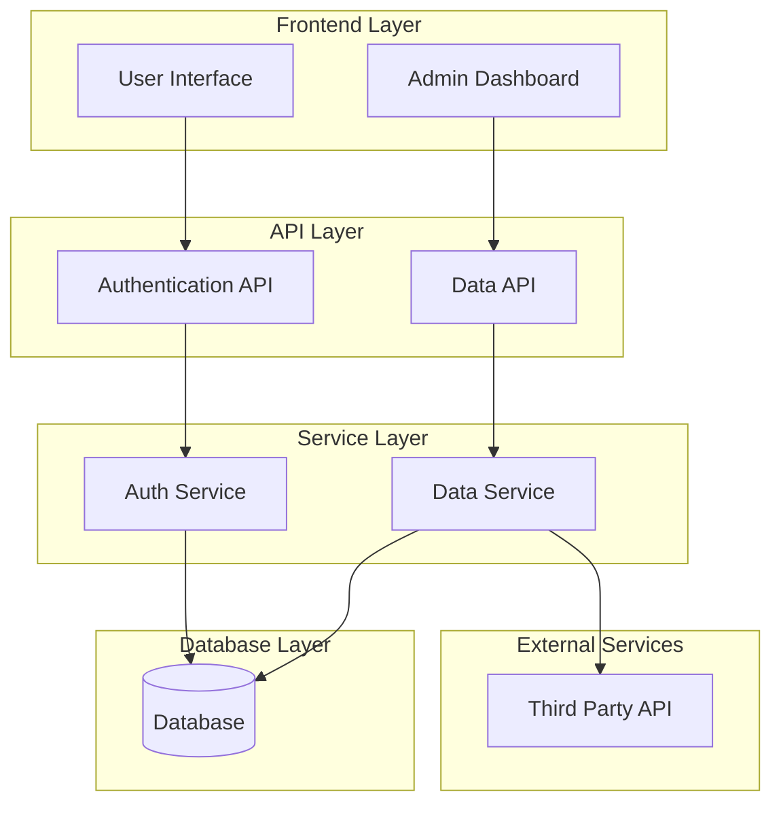
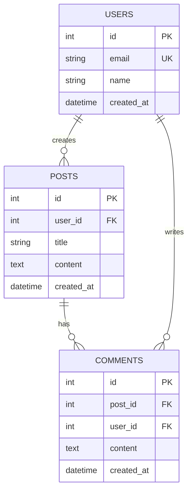
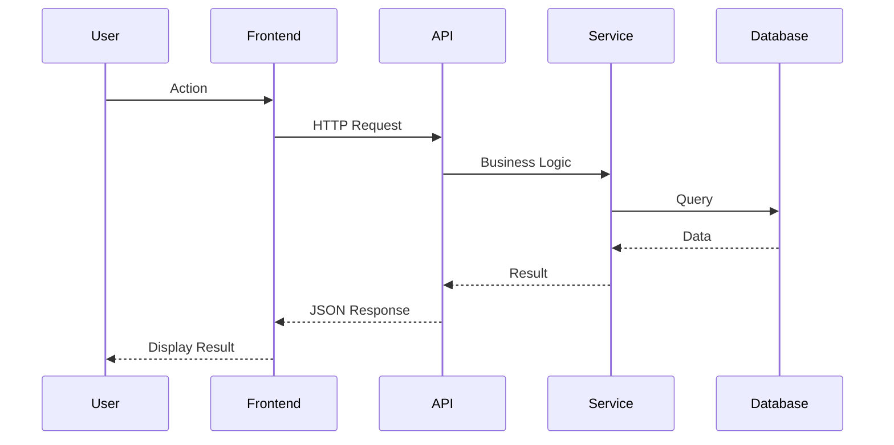
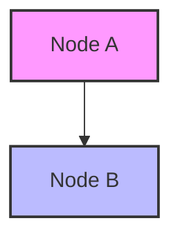
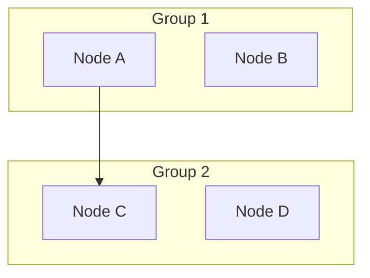
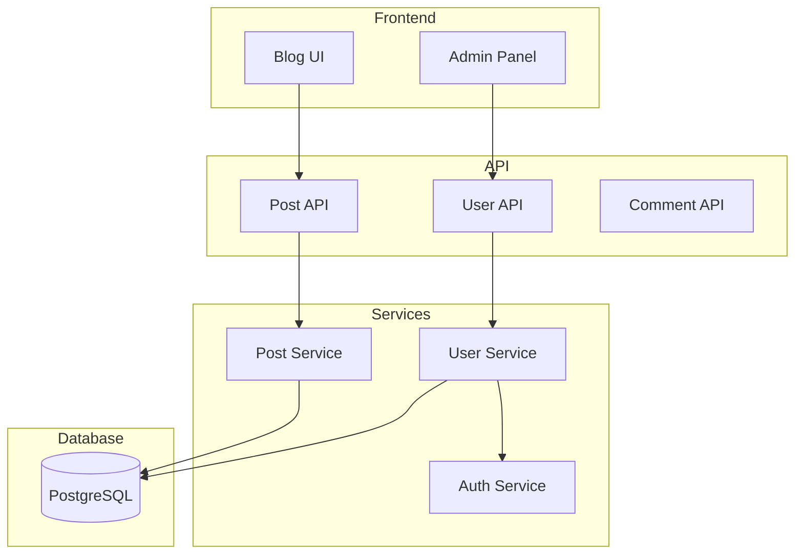
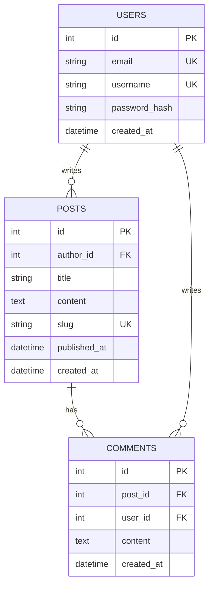
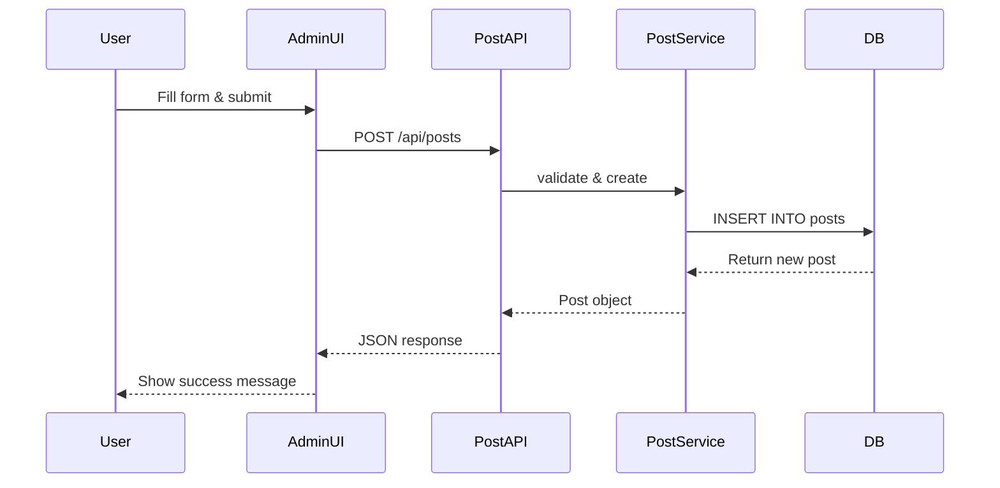

# 📋 Documentation Template Prompt for API & Database Flow Diagrams

## 🎯 Purpose
This is a reusable prompt/template for creating comprehensive API and database flow documentation for any project, similar to `API_DATABASE_FLOW_DIAGRAM.md`.

---

## 🤖 AI Prompt Template

```
Create a comprehensive API Flow & Database Relationships documentation file for [PROJECT_NAME].

Include the following sections:

1. System Architecture Overview
   - Create a Mermaid flowchart showing:
     - Frontend Layer (UI components)
     - API Layer (all API endpoints)
     - Service Layer (business logic services)
     - Database Layer (PostgreSQL/MySQL/etc)
     - External Services (third-party APIs)
   - Show connections between layers with arrows

2. Database Schema Relationships
   - Create a Mermaid ER diagram showing:
     - All database tables
     - Primary keys (PK)
     - Foreign keys (FK)
     - Unique keys (UK)
     - Relationships between tables
     - Key columns with data types

3. API Endpoints Map
   - List all API routes organized by feature
   - Include HTTP methods (GET, POST, PUT, DELETE)
   - Include request/response examples
   - Document authentication requirements

4. Data Flow Diagrams
   - Show how data flows through the system
   - Include user actions → API → Service → Database
   - Show external service integrations

5. Feature Version History
   - Track all features with timestamps
   - Document changes, migrations, and rollbacks
   - Include confirmation protocols if needed

Use Mermaid syntax for all diagrams. Format as a Markdown file.
```

---

## 📐 Mermaid Diagram Syntax Examples

### 1. System Architecture Flowchart



### 2. Database ER Diagram



### 3. Sequence Diagram (for API flows)



---

## 📝 Documentation Structure Template

```markdown
# [Project Name] - API Flow & Database Relationships

## 🏗️ System Architecture Overview

[Insert Mermaid flowchart here]

### Key Components
- **Frontend Layer**: [Description]
- **API Layer**: [Description]
- **Service Layer**: [Description]
- **Database Layer**: [Description]
- **External Services**: [List]

## 📊 Database Schema Relationships

[Insert Mermaid ER diagram here]

### Tables Overview
- `table1`: [Purpose]
- `table2`: [Purpose]
- etc.

## 🔌 API Endpoints Map

### Authentication
- `POST /api/auth/login` - User login
- `POST /api/auth/logout` - User logout
- etc.

### [Feature 1]
- `GET /api/feature1` - List items
- `POST /api/feature1` - Create item
- etc.

## 🔄 Data Flow Examples

### Example 1: [User Action]
[Describe the flow with Mermaid sequence diagram]

## 📋 Feature Version History

### Version 1.0 - [Date]
- Feature: [Description]
- Changes: [What changed]
- Migration: [SQL migration file]
- Rollback: [How to rollback]

## 🔐 Security & Credentials

[Document how credentials are managed]

## 📊 Quota Tracking

[Document API quotas and limits]

## 🚀 Deployment

[Deployment steps and procedures]
```

---

## 🛠️ Step-by-Step Guide to Create Documentation

### Step 1: Analyze Your Codebase

1. **List all API routes:**
   ```bash
   # Find all route files
   find . -name "*route*.ts" -o -name "*route*.js"
   
   # Or search for route definitions
   grep -r "router\." . --include="*.ts" --include="*.js"
   ```

2. **List all database tables:**
   ```bash
   # Find migration files
   find . -name "*.sql" | grep -i migration
   
   # Or check schema files
   find . -name "*schema*.sql" -o -name "*setup*.sql"
   ```

3. **List all services:**
   ```bash
   find . -name "*service*.ts" -o -name "*service*.js"
   ```

### Step 2: Create Mermaid Diagrams

**For System Architecture:**
- Start with user actions
- Add frontend components
- Add API endpoints
- Add service layer
- Add database
- Add external services
- Connect with arrows showing data flow

**For Database Schema:**
- List each table
- Show primary keys (PK)
- Show foreign keys (FK)
- Show unique keys (UK)
- Show relationships (one-to-many, many-to-many)
- Include key columns with types

### Step 3: Document API Endpoints

Organize by feature:
- Authentication
- User Management
- Data Operations
- etc.

For each endpoint, include:
- HTTP method
- Path
- Request body (if any)
- Response format
- Authentication requirements
- Example request/response

### Step 4: Document Data Flows

Create sequence diagrams for:
- User registration
- User login
- Data creation
- Data updates
- External API calls
- etc.

### Step 5: Add Version History

Track:
- Feature additions
- Database migrations
- API changes
- Breaking changes
- Rollback procedures

---

## 🎨 Mermaid Syntax Cheat Sheet

### Graph Types
- `graph TB` - Top to bottom
- `graph LR` - Left to right
- `graph TD` - Top down (same as TB)

### Node Shapes
- `[Square]` - Default rectangle
- `(Round)` - Round edges
- `{Diamond}` - Decision
- `((Circle))` - Circle
- `[/Parallelogram/]` - Parallelogram

### Styling


### Subgraphs


### ER Diagram Relationships
- `||--o{` - One to many
- `}o--||` - Many to one
- `||--||` - One to one
- `}o--o{` - Many to many

---

## 📚 Example: Complete Documentation for a Blog System

```markdown
# Blog Platform - API Flow & Database Relationships

## 🏗️ System Architecture Overview



## 📊 Database Schema



## 🔌 API Endpoints

### Posts
- `GET /api/posts` - List all posts
- `GET /api/posts/:id` - Get single post
- `POST /api/posts` - Create post (auth required)
- `PUT /api/posts/:id` - Update post (auth required)
- `DELETE /api/posts/:id` - Delete post (auth required)

### Comments
- `GET /api/posts/:id/comments` - Get comments for post
- `POST /api/posts/:id/comments` - Add comment (auth required)

## 🔄 Data Flow: Creating a Post


```

---

## 🚀 Quick Start: Generate Documentation for Your Project

1. **Copy the prompt template above**
2. **Replace `[PROJECT_NAME]` with your project name**
3. **Provide the AI with:**
   - Your project structure
   - List of API routes
   - Database schema
   - External services used
4. **Ask the AI to generate the documentation**
5. **Review and customize the output**
6. **Add version history as you make changes**

---

## 💡 Tips for Best Results

1. **Be Specific**: Provide actual file paths, table names, and API routes
2. **Include Context**: Mention the tech stack (Node.js, Python, etc.)
3. **Update Regularly**: Keep documentation in sync with code changes
4. **Use Version Control**: Commit documentation changes with code
5. **Add Examples**: Include real request/response examples
6. **Document Edge Cases**: Note special handling or limitations

---

## 📖 Resources

- **Mermaid Documentation**: https://mermaid.js.org/
- **Mermaid Live Editor**: https://mermaid.live/
- **Markdown Guide**: https://www.markdownguide.org/

---

**Template Version**: 1.0  
**Last Updated**: 2025-01-09  
**Based on**: MarketingBy_web_app_react API_DATABASE_FLOW_DIAGRAM.md

