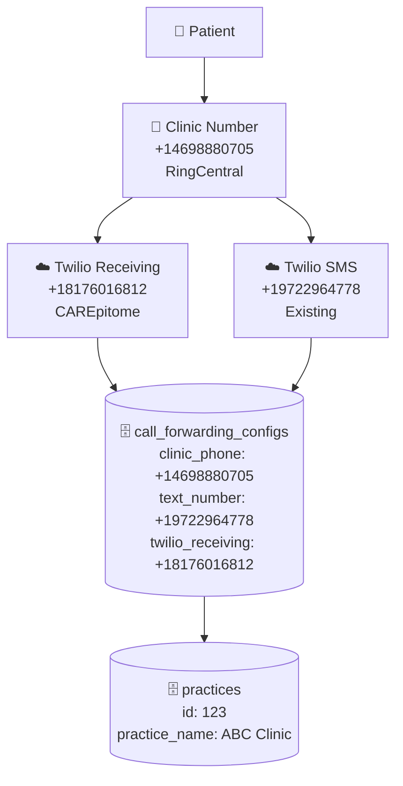

# Fixed Mermaid Diagram - Call Forwarding

## ❌ Wrong (causes parse error):
```mermaid
graph TB
    Patient[👤 Patient]
    ClinicNum[📱 Clinic's Number<br/>+14698880705<br/>RingCentral]
    TwilioCall[☁️ Twilio Receiving Number<br/>+18176016812<br/>CAREpitome]
    PracticeDB[(🗄️ practices<br/>id: 123<br/>practice_name: "ABC Clinic")]
```

## ✅ Correct (fixed syntax):



## 📝 Mermaid Syntax Rules:

1. **Line Breaks**: Use `\n` instead of `<br/>`
2. **Quotes**: Use double quotes `"..."` around labels with special characters
3. **Database Nodes**: Use `[("...")]` for database/cylinder shape
4. **Special Characters**: Escape or quote labels with colons, quotes, etc.
5. **No HTML**: Mermaid doesn't support HTML tags

## ✅ Alternative (Cleaner Version):


**Note**: Actually, Mermaid doesn't support `<br/>` at all. You MUST use `\n` for line breaks.

## ✅ Final Working Version:


