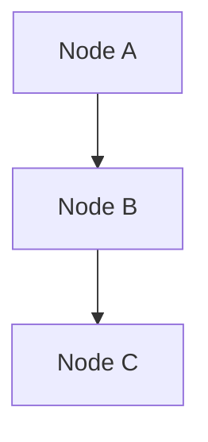
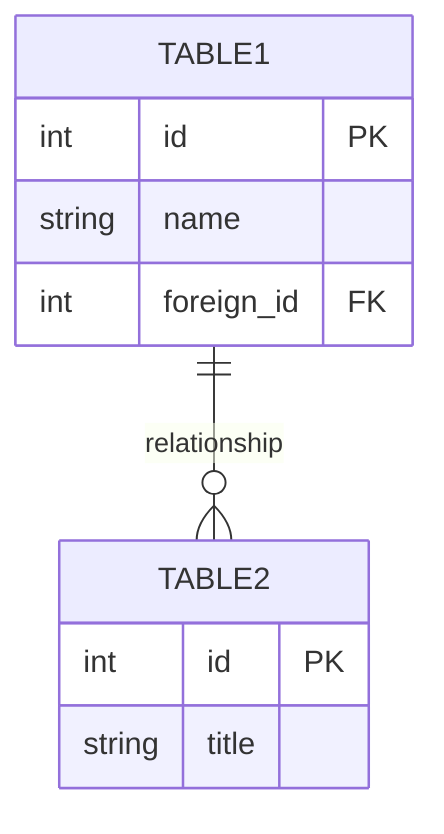
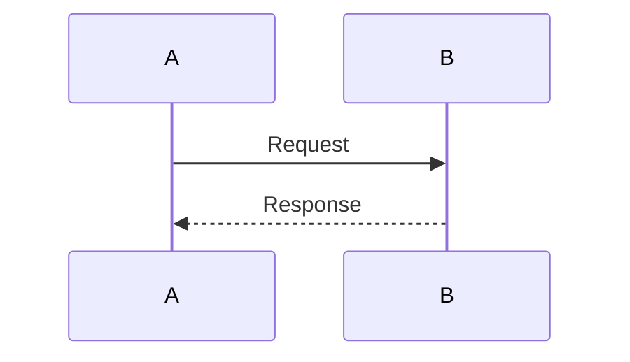
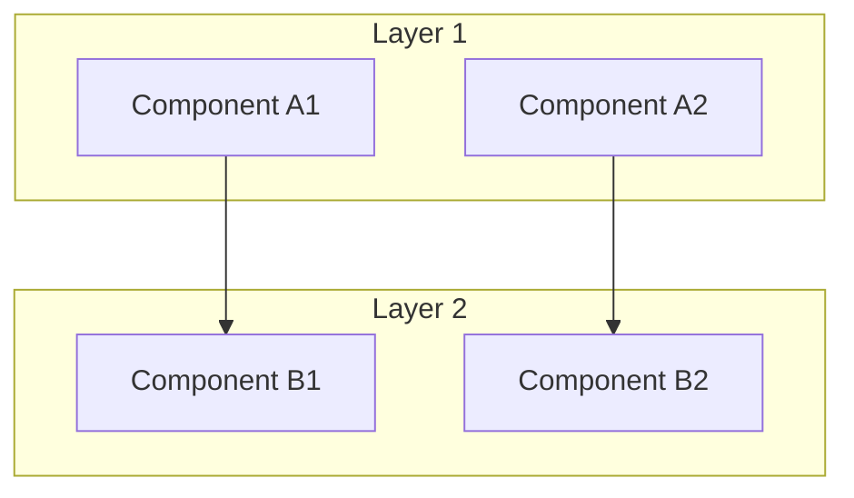
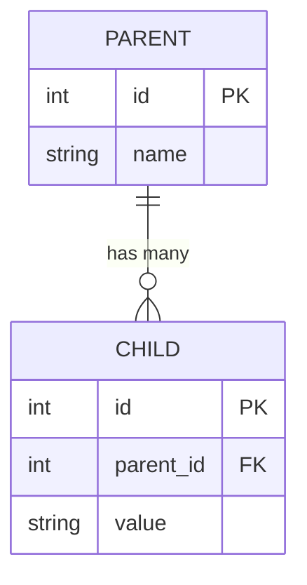
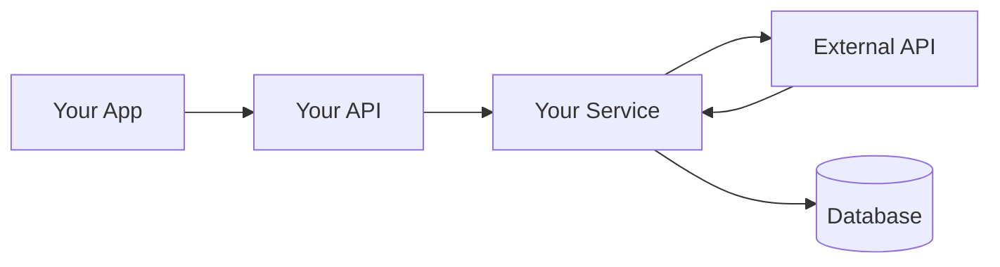

# 🎨 Mermaid Diagram Quick Reference

## 📊 Diagram Types Used in API_DATABASE_FLOW_DIAGRAM.md

### 1. Flowchart (System Architecture)
**Syntax:**


**Used for:**
- System architecture
- Data flow
- Process flows
- Component relationships

### 2. ER Diagram (Database Schema)
**Syntax:**


**Used for:**
- Database schema
- Table relationships
- Entity relationships

### 3. Sequence Diagram (API Flows)
**Syntax:**


**Used for:**
- API request/response flows
- User interactions
- Service communications

---

## 🔧 Common Patterns from Your Documentation

### Pattern 1: Multi-Layer Architecture


### Pattern 2: Database Relationships


### Pattern 3: External Service Integration


---

## 🎯 How to Create Similar Documentation

### Step 1: Analyze Your Code
```bash
# Find all routes
grep -r "router\." . --include="*.ts" --include="*.js"

# Find all services
find . -name "*service*.ts" -o -name "*service*.js"

# Find database tables
find . -name "*.sql" | xargs grep "CREATE TABLE"
```

### Step 2: Create the Flowchart
1. List all frontend components
2. List all API endpoints
3. List all services
4. List database tables
5. List external services
6. Connect them with arrows

### Step 3: Create the ER Diagram
1. List all tables
2. For each table, list:
   - Primary key (PK)
   - Foreign keys (FK)
   - Unique keys (UK)
   - Important columns
3. Show relationships between tables

### Step 4: Document API Endpoints
Organize by feature:
- Authentication
- User Management
- Data Operations
- etc.

---

## 💡 Pro Tips

1. **Use Subgraphs** to group related components
2. **Use Descriptive Names** for nodes
3. **Show Direction** with arrows (--> for one-way, <--> for bidirectional)
4. **Add Styling** for important nodes
5. **Keep It Simple** - don't overcrowd diagrams
6. **Update Regularly** - keep docs in sync with code

---

## 🔗 Resources

- **Mermaid Live Editor**: https://mermaid.live/ (test your diagrams here)
- **Mermaid Docs**: https://mermaid.js.org/
- **GitHub Support**: Mermaid works natively in GitHub markdown files

